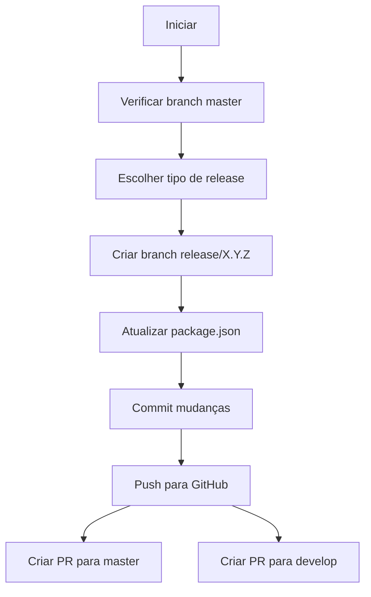

# Deploy Scripts

Esta pasta contém scripts para facilitar o processo de deploy e release do projeto mind-api-\*.

## 📋 Scripts Disponíveis

### `create-release.sh`

Script automatizado para criação de releases seguindo o padrão de versionamento semântico (SemVer).

#### 🎯 Funcionalidades

- ✅ Verifica e atualiza automaticamente a branch `master`
- ✅ Cria branch de release no formato `release/X.Y.Z`
- ✅ Atualiza versão automaticamente usando `npm version` nos arquivos `package.json` e `yarn.lock`
- ✅ Garante consistência entre package.json e yarn.lock
- ✅ Cria commits automáticos com a nova versão
- ✅ Publica a branch no GitHub
- ✅ Cria Pull Requests automaticamente para `master` e `develop`
- ✅ Validações de segurança (branch correta, sem mudanças pendentes, etc.)

#### 📦 Pré-requisitos

Antes de usar o script, certifique-se de ter:

1. **Node.js e npm** instalados para gerenciamento de versões:

   ```bash
   # Verificar se estão instalados
   node --version
   npm --version
   ```

2. **GitHub CLI (`gh`)** instalado e configurado:

   ```bash
   # macOS
   brew install gh

   # Linux
   # Veja: https://cli.github.com/

   # Autenticação
   gh auth login
   ```

3. **Git** configurado com suas credenciais

4. **Permissões** para criar branches e Pull Requests no repositório

#### 🚀 Como Usar

1. **Navegue até a raiz do projeto** (não precisa estar na pasta `.deploy`):

   ```bash
   cd /caminho/para/mind-api-*
   ```

2. **Execute o script**:

   ```bash
   ./.deploy/create-release.sh
   ```

3. **Siga o assistente interativo** que irá perguntar:
   - Tipo de release (Major/Minor/Patch)
   - Confirmação da nova versão

#### 📝 Tipos de Release (SemVer)

O script segue o padrão de versionamento semântico `MAJOR.MINOR.PATCH`:

##### **1. MAJOR** (Versão principal)

- **Quando usar**: Mudanças que quebram compatibilidade
- **Exemplo**: `2.358.1` → `3.0.0`
- **Casos de uso**:
  - Remoção de endpoints ou funcionalidades
  - Mudanças na estrutura de dados que quebram contratos
  - Alterações que exigem migração dos clientes

##### **2. MINOR** (Versão secundária)

- **Quando usar**: Novas funcionalidades mantendo compatibilidade
- **Exemplo**: `2.358.1` → `2.359.0`
- **Casos de uso**:
  - Novos endpoints ou Cloud Functions
  - Novas funcionalidades no GraphQL
  - Adição de campos opcionais em APIs existentes
  - Melhorias e otimizações

##### **3. PATCH** (Correção)

- **Quando usar**: Correções de bugs
- **Exemplo**: `2.358.1` → `2.358.2`
- **Casos de uso**:
  - Hotfixes
  - Correções de bugs
  - Ajustes de performance
  - Correções de segurança

#### ⚠️ Atenções e Boas Práticas

##### **Antes de Executar**

1. ✅ **Certifique-se de estar na branch `master`**

   - O script verifica e oferece trocar automaticamente se necessário

2. ✅ **Commit ou stash suas mudanças**

   - Não pode haver modificações não commitadas

   ```bash
   git status  # Verifique o status
   git stash   # Ou guarde temporariamente
   ```

3. ✅ **Atualize sua branch local**

   ```bash
   git pull origin master
   ```

4. ✅ **Verifique a versão atual**
   ```bash
   grep '"version"' package.json
   ```

##### **Durante a Execução**

1. ⚠️ **Escolha o tipo correto de release**

   - Avalie o impacto das mudanças
   - Consulte o time em caso de dúvida
   - Revise o [CHANGELOG](../CHANGELOG.md) se disponível

2. ⚠️ **Confirme o tipo de release**
   - O script agora pergunta o tipo de release antes de calcular a versão
   - A nova versão será calculada automaticamente pelo `npm version`
   - Confirme antes de prosseguir

##### **Após a Execução**

1. ✅ **Revise os Pull Requests criados**

   - Adicione descrição detalhada no changelog
   - Liste todas as mudanças importantes
   - Mencione breaking changes se houver

2. ✅ **Aguarde CI/CD passar**

   - Testes unitários
   - Testes de integração
   - Validações de lint/formato

3. ✅ **Solicite code review**

   - Pelo menos uma aprovação
   - Revisão de mudanças críticas

4. ✅ **Merge na ordem correta**
   - Primeiro: PR para `develop` (testes em staging)
   - Depois: PR para `master` (produção)

#### 🔍 Exemplo de Uso Completo

```bash
# 1. Verificar branch e status
$ git branch
* master
$ git status
On branch master
nothing to commit, working tree clean

# 2. Verificar versão atual
$ grep '"version"' package.json
  "version": "2.358.1",

# 3. Executar script
$ ./.deploy/create-release.sh

# Output esperado:
# ✓ Branch master atualizada
# Versão atual: 2.358.1
#
# Qual tipo de release deseja criar?
# 1) Minor (nova funcionalidade)
# 2) Patch (correção de bug)
#
# Escolha (1/2): 1
# Deseja continuar com a criação da release minor? (s/n): s
#
# Iniciando processo de release...
# 1/6 - Atualizando versão com npm version...
# Atualizando versão usando npm version minor...
# ✓ Arquivo package.json atualizado
# Nova versão: 2.359.0
# 2/6 - Criando branch release/2.359.0...
# ✓ Branch criada
# 3/6 - Commitando mudanças dos arquivos package*...
# ✓ Mudanças commitadas
# 4/6 - Fazendo push para o GitHub...
# ✓ Push realizado com sucesso
# 5/6 - Criando Pull Request para master...
# ✓ PR para master criado
#    https://github.com/Multiplan-MIND/mind-api-*/pull/123
# 6/6 - Criando Pull Request para develop...
# ✓ PR para develop criado
#    https://github.com/Multiplan-MIND/mind-api-*/pull/124
#
# ════════════════════════════════════════
# ✓ Release 2.359.0 criada com sucesso!
# ════════════════════════════════════════
```

#### 🐛 Troubleshooting

##### Erro: "npm não está instalado"

```bash
# Instalar Node.js e npm (recomendado via nvm)
curl -o- https://raw.githubusercontent.com/nvm-sh/nvm/v0.39.0/install.sh | bash
nvm install node
nvm use node

# Ou instalar diretamente
# Ubuntu/Debian
sudo apt update
sudo apt install nodejs npm

# macOS
brew install node
```

##### Erro: "GitHub CLI (gh) não está instalado"

```bash
# macOS
brew install gh

# Ubuntu/Debian
curl -fsSL https://cli.github.com/packages/githubcli-archive-keyring.gpg | sudo dd of=/usr/share/keyrings/githubcli-archive-keyring.gpg
echo "deb [arch=$(dpkg --print-architecture) signed-by=/usr/share/keyrings/githubcli-archive-keyring.gpg] https://cli.github.com/packages stable main" | sudo tee /etc/apt/sources.list.d/github-cli.list > /dev/null
sudo apt update
sudo apt install gh
```

##### Erro: "Você não está autenticado no GitHub CLI"

```bash
gh auth login
# Siga as instruções interativas
```

##### Erro: "Há mudanças não commitadas"

```bash
# Opção 1: Commit as mudanças
git add .
git commit -m "feat: descrição das mudanças"

# Opção 2: Guardar temporariamente
git stash
# Após criar a release:
git stash pop
```

##### Erro: "Você deve estar na branch 'master'"

```bash
git checkout master
git pull origin master
# Execute o script novamente
```

##### PR não criado para develop

- Verifique se a branch `develop` existe no repositório
- Crie manualmente se necessário:
  ```bash
  gh pr create --base develop --head release/X.Y.Z
  ```

#### 🔄 Workflow Completo



#### 📚 Referências

- [Semantic Versioning 2.0.0](https://semver.org/lang/pt-BR/)
- [GitHub CLI Manual](https://cli.github.com/manual/)
- [Git Flow](https://nvie.com/posts/a-successful-git-branching-model/)

---

### `manage-prs.sh`

Script interativo para gerenciar Pull Requests existentes e consolidá-los em uma branch de release. Permite reapontar PRs para a branch de release e fazer merge automático, consolidando os changelogs.

#### 🎯 Funcionalidades

- ✅ Lista PRs abertos apontando para `master`
- ✅ Detecta automaticamente PRs de release da branch atual
- ✅ Reapontamento automático de PRs para a branch de release
- ✅ Merge automático com estratégia squash
- ✅ Coleta e consolida changelogs dos PRs
- ✅ Atualiza automaticamente os PRs de release com os changelogs consolidados
- ✅ Deleta branches automaticamente após merge

#### 📦 Pré-requisitos

Os mesmos do `create-release.sh`:

1. **GitHub CLI (`gh`)** instalado e autenticado
2. **Git** configurado
3. **Permissões** para gerenciar PRs e fazer merge
4. Estar em uma branch de release (ex: `release/2.359.0`)

#### 🚀 Como Usar

1. **Navegue até a raiz do projeto** e certifique-se de estar em uma branch de release:

   ```bash
   cd /caminho/para/mind-api-*
   git checkout release/2.359.0
   ```

2. **Execute o script**:

   ```bash
   ./.deploy/manage-prs.sh
   ```

3. **Gerencie os PRs interativamente**:
   - Digite o número de um PR para processá-lo
   - Use `list` para listar PRs disponíveis
   - Use `0` para sair

#### 🔄 Workflow de Uso

##### **Cenário 1: Consolidar PRs em uma Release**

Após criar uma release com `create-release.sh`, você tem várias features prontas para merge:

```bash
# 1. Criar a release
$ ./.deploy/create-release.sh
# Cria release/2.359.0 com PRs #123 (master) e #124 (develop)

# 2. Gerenciar PRs existentes
$ ./.deploy/manage-prs.sh

# Output:
# ✓ PR para master encontrado: #123
# ✓ PR para develop encontrado: #124
#
# Gerenciamento de Pull Requests Existentes
# ═══════════════════════════════════════
#
# Digite o número de um PR existente para reapontar para release/2.359.0
# e fazer merge automaticamente.
#
# PRs da Release:
#   → Master: #123
#   → Develop: #124
#
# Opções:
#   [número] - Processar PR específico (ex: 99)
#   list     - Listar PRs abertos apontando para master
#   0        - Sair
#
# PR número (ou comando): list

# Lista PRs disponíveis:
# #99  feat: nova funcionalidade de estacionamento
# #100 fix: correção crítica no parse
# #101 feat: integração com novo parceiro

# PR número (ou comando): 99

# Informações do PR #99:
#   Título: feat: nova funcionalidade de estacionamento
#   De: feature/parking-enhancement
#   Para: master → release/2.359.0
#   Changelog encontrado:
#     - Implementação de reserva de vagas VIP
#     - Integração com sistema de pagamento digital
#     - Melhorias na performance de consulta
#
# Confirma reapontamento e merge? (s/n): s
# ✓ PR #99 reapontado para release/2.359.0
# ✓ PR #99 merged com sucesso!
# ✓ Branch feature/parking-enhancement deletada
# ✓ Changelog coletado
# ✓ PR #123 (master) atualizado
# ✓ PR #124 (develop) atualizado
```

##### **Cenário 2: Adicionar Feature de Última Hora**

Durante o ciclo de release, uma feature urgente precisa ser incluída:

```bash
# Feature já tem PR #102 apontando para master
$ ./.deploy/manage-prs.sh

# PR número (ou comando): 102

# Informações do PR #102:
#   Título: feat: implementar cashback especial
#   De: feature/special-cashback
#   Para: master → release/2.359.0
#   Changelog encontrado:
#     - Sistema de cashback para Black Friday
#     - Configuração por shopping center
#
# Confirma reapontamento e merge? (s/n): s
# ✓ PR #102 merged com sucesso!
# ✓ Changelogs dos PRs de release atualizados
```

#### 📝 Estrutura de Changelog

O script busca e consolida changelogs automaticamente. Para que funcione corretamente, os PRs devem ter changelogs no formato:

```markdown
## Changelog:

- Descrição da mudança 1
- Descrição da mudança 2
- Descrição da mudança 3
```

**Dica**: Use templates de PR que já incluam a seção `## Changelog:` para facilitar.

#### ⚠️ Atenções e Boas Práticas

##### **Antes de Executar**

1. ✅ **Certifique-se de estar em uma branch de release**

   ```bash
   git branch --show-current
   # Deve retornar: release/X.Y.Z
   ```

2. ✅ **Verifique se os PRs estão prontos para merge**

   - Aprovados por revisores
   - CI/CD passou com sucesso
   - Sem conflitos

3. ✅ **Comunique com o time**
   - Informe que está consolidando a release
   - Evite que outros façam merge durante o processo

##### **Durante a Execução**

1. ⚠️ **Processe um PR por vez**

   - O script é sequencial por segurança
   - Aguarde a confirmação de merge antes do próximo

2. ⚠️ **Revise as informações do PR antes de confirmar**

   - Título e branch de origem
   - Changelog que será adicionado
   - Confirme que é o PR correto

3. ⚠️ **Use `list` para explorar PRs disponíveis**
   - Veja todos os PRs abertos para master
   - Identifique quais devem fazer parte da release

##### **Após a Execução**

1. ✅ **Verifique os changelogs consolidados**

   - Acesse os PRs de release (#master e #develop)
   - Confirme que todos os changelogs foram adicionados
   - Edite se necessário para melhorar descrições

2. ✅ **Faça um último teste local**

   ```bash
   git pull origin release/X.Y.Z
   npm install
   npm test
   ```

3. ✅ **Finalize o ciclo de release**
   - Aguarde aprovações nos PRs de release
   - Merge primeiro em develop (staging)
   - Depois em master (produção)

#### 🔍 Exemplo de Uso Completo

```bash
$ git checkout release/2.359.0
$ ./.deploy/manage-prs.sh

# ═══════════════════════════════════════
# Gerenciamento de Pull Requests Existentes
# ═══════════════════════════════════════
#
# Digite o número de um PR existente para reapontar para release/2.359.0
# e fazer merge automaticamente.
#
# PRs da Release:
#   → Master: #123
#   → Develop: #124
#
# Opções:
#   [número] - Processar PR específico (ex: 99)
#   list     - Listar PRs abertos apontando para master
#   0        - Sair
#
# PR número (ou comando): list

# PRs abertos apontando para master:
#
# #99   feat: reserva de vagas VIP           feature/parking-vip
# #100  fix: correção parse de tickets       hotfix/parse-tickets
# #102  feat: cashback Black Friday          feature/special-cashback
# #103  refactor: otimização de queries      refactor/query-optimization

# PR número (ou comando): 99
# Verificando PR #99...
#
# Informações do PR #99:
#   Título: feat: reserva de vagas VIP
#   De: feature/parking-vip
#   Para: master → release/2.359.0
#   Changelog encontrado:
#     - Implementação de reserva de vagas VIP
#     - Integração com sistema de pagamento
#     - API GraphQL para gerenciamento de reservas
#
# Confirma reapontamento e merge? (s/n): s
# Reapontando PR #99 para release/2.359.0...
# ✓ PR #99 reapontado para release/2.359.0
# Fazendo merge do PR #99...
# ✓ PR #99 merged com sucesso!
# ✓ Branch feature/parking-vip deletada
# ✓ Changelog coletado
# Atualizando changelogs nos PRs de release...
# ✓ PR #123 (master) atualizado
# ✓ PR #124 (develop) atualizado

# PR número (ou comando): 100
# Verificando PR #100...
#
# Informações do PR #100:
#   Título: fix: correção parse de tickets
#   De: hotfix/parse-tickets
#   Para: master → release/2.359.0
#   Changelog encontrado:
#     - Correção no parse de tickets especiais
#     - Fix em edge case de horário
#
# Confirma reapontamento e merge? (s/n): s
# ✓ PR #100 merged com sucesso!
# ✓ PR #123 (master) atualizado
# ✓ PR #124 (develop) atualizado

# PR número (ou comando): 0
# Processo finalizado!

# Agora os PRs #123 e #124 contêm:
# ## Changelog:
# - Implementação de reserva de vagas VIP
# - Integração com sistema de pagamento
# - API GraphQL para gerenciamento de reservas
# - Correção no parse de tickets especiais
# - Fix em edge case de horário
```

#### 🐛 Troubleshooting

##### Erro: "PR não encontrado"

```bash
# Verifique se o número está correto
gh pr view 99

# Liste todos os PRs
gh pr list --state open
```

##### Erro: "Erro ao executar npm version"

```bash
# Verificar se o package.json é válido
npm run test --dry-run

# Verificar se há mudanças não commitadas
git status

# Verificar se o repositório está no estado correto
git log --oneline -n 5
```

##### Erro ao fazer merge: "PR não aprovado"

- Configure aprovações automáticas temporariamente (se permitido)
- Ou solicite aprovação antes de executar o script
- Ou faça merge manual: `gh pr merge 99 --admin`

##### Erro ao fazer merge: "Conflitos detectados"

```bash
# Resolva conflitos localmente primeiro
git checkout feature/branch-com-conflito
git merge release/2.359.0
# Resolva conflitos
git push

# Execute o script novamente
```

##### Changelog não é detectado

- Verifique o formato no PR (deve ter `## Changelog:`)
- Adicione manualmente aos PRs de release se necessário:
  ```bash
  gh pr edit 123 --body "$(cat changelog.md)"
  ```

##### Branch não deletada após merge

```bash
# Delete manualmente
git push origin --delete feature/branch-name
```

#### 💡 Dicas Avançadas

##### **1. Verificar versão antes de criar release**

```bash
# Ver versão atual
npm version --json

# Ver histórico de versões
git tag --sort=-version:refname | head -10
```

##### **2. Processar múltiplos PRs rapidamente**

Prepare uma lista de PRs e processe em sequência:

```bash
# PRs para adicionar: 99, 100, 102
$ ./.deploy/manage-prs.sh
# Digite: 99 [Enter] s [Enter] 100 [Enter] s [Enter] 102 [Enter] s [Enter] 0
```

##### **3. Verificar changelogs antes de finalizar**

Após consolidar todos os PRs, revise os changelogs:

```bash
# Ver changelog do PR de master
gh pr view 123 --json body --jq '.body'

# Editar se necessário
gh pr edit 123 --body "$(cat novo-changelog.md)"
```

##### **4. Automatizar listagem de PRs candidatos**

```bash
# Listar PRs prontos para merge (aprovados e CI passou)
gh pr list --base master --state open --json number,title,statusCheckRollup \
  --jq '.[] | select(.statusCheckRollup[].conclusion == "SUCCESS") | "#\(.number) - \(.title)"'
```

##### **5. Backup antes de processar**

```bash
# Salvar estado atual
git branch backup-release-$(date +%Y%m%d)
git push origin backup-release-$(date +%Y%m%d)
```

#### 🔗 Integração com create-release.sh

Os dois scripts foram projetados para trabalhar juntos:

```bash
# 1. Criar release
$ ./.deploy/create-release.sh
# Cria release/2.359.0 com PRs #123 e #124

# 2. Adicionar features à release
$ ./.deploy/manage-prs.sh
# Merge PRs #99, #100, #102 na release
# Changelogs consolidados automaticamente

# 3. Finalizar release
$ git checkout release/2.359.0
$ git pull
$ npm test

# 4. Merge dos PRs de release
$ gh pr merge 124 --squash  # develop primeiro (staging)
# Testar em staging
$ gh pr merge 123 --squash  # master depois (produção)
```

#### 📚 Referências

- [GitHub CLI PR Commands](https://cli.github.com/manual/gh_pr)
- [Git Merge Strategies](https://git-scm.com/docs/merge-strategies)
- [Squash Merging](https://docs.github.com/en/pull-requests/collaborating-with-pull-requests/incorporating-changes-from-a-pull-request/about-pull-request-merges#squash-and-merge-your-commits)

---

#### 🤝 Contribuindo

Se encontrar problemas ou tiver sugestões de melhoria para os scripts, abra uma issue ou PR no repositório.

#### 🔄 Melhorias Recentes

##### **v2.0 - Novembro 2025**

- ✅ **Uso do `npm version`**: O script agora utiliza `npm version` para atualizar automaticamente tanto `package.json` quanto `yarn.lock`, garantindo consistência entre os arquivos
- ✅ **Simplificação**: Remoção de cálculos manuais de versão, delegando para o npm a responsabilidade de incrementar corretamente as versões
- ✅ **Melhor tratamento de erros**: Validação se npm está instalado e tratamento de erros do comando `npm version`
- ✅ **Sincronização automática**: Garante que yarn.lock seja sempre atualizado junto com package.json

---

**Última atualização**: Novembro 2025
**Mantido por**: Time de Desenvolvimento Mind
